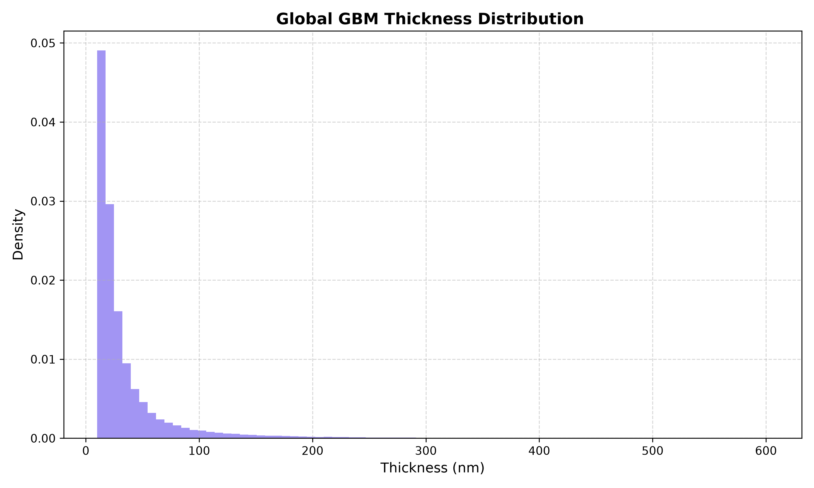
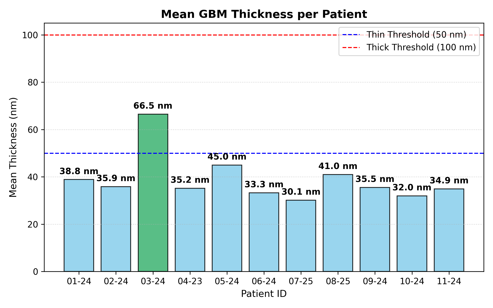

# Quantitative Analysis of Glomerular Basement Membrane (GBM) Thickness Distributions in Diabetic Patients 

## 🎯 What Does This Project Mean? (Project Context)
Glomerular Basement Membrane (GBM) thickening is a key structural indicator of Diabetic Kidney Disease (DKD). Standard clinical evaluations often rely on basic manual spot-checks, which miss local variations across the membrane. 

**The core goal of this project** is to automatically measure the orthogonal thickness of the GBM along its entire length from Transmission Electron Microscopy (TEM) images. By doing so, we aim to statistically test whether diabetic GBM thickening follows a **bi-modal or multi-modal distribution** (having multiple distinct peaks/thickness populations) rather than a uniform single-peak distribution.

---

## ✅ What Has Been Done So Far

### 1. Physical Scale Calibration
* Calibrated the pixel density against high-magnification TEM scale bars ($1\ \mu\text{m} = 1010\text{ pixels}$).
* Established the true resolution scale: **$1\text{ pixel} \approx 0.9901\text{ nm}$**.

### 2. Automated Image Processing Pipeline (`gbm_analysis.py`)
* **Preprocessing:** Cleaned binary TEM masks using morphological closing operations.
* **Skeletonization:** Extracted the centerline of the membrane structures.
* **Orthogonal Measurement:** Applied Euclidean Distance Transform along the skeleton to compute accurate perpendicular thickness values in nanometers.
* **Data Processing & Aggregation:** Automatically extracted patient and glomerulus metadata from image filenames, exported raw statistics to CSV, and aggregated patient-level thickness averages.

### 3. Patient Cohort Analysis & Observations
* Aggregated measurements across **11 patients** (`01-24` through `11-24`).
* Evaluated results against clinical reference baselines:
  * **Thin Threshold:** $50\text{ nm}$
  * **Thick Threshold:** $100\text{ nm}$
* **Key Findings:** 
  * Observed that overall calibrated thickness distributions show a right-skewed profile with potential secondary peaks/shoulders, supporting the hypothesis of localized membrane thickening.
  * Patient `03-24` displays a markedly higher mean thickness (**$66.5\text{ nm}$**), crossing above the $50\text{ nm}$ baseline compared to the rest of the cohort ($30.1\text{ nm}$ to $45.0\text{ nm}$).

---

## 📊 Visualizations

### 1. Global GBM Thickness Distribution Profile

> **Figure 1:** Combined thickness distribution across TEM membrane measurements showing a right-skewed profile with secondary shoulders.

---

### 2. Mean GBM Thickness per Patient

> **Figure 2:** Comparison of GBM thickness of 11 patients. ($50\text{ nm}$ and $100\text{ nm}$).

---

## 🔮 What Needs To Be Done Next (Tasks Ahead)

- [x] **Patient-Level Data Aggregation:** Grouped thickness statistics per `Patient_ID` and analyzed cohort variability.
- [x] **Patient Comparison Charts:** Generated mean thickness comparison bar charts with clinical threshold overlays.
- [ ] **Statistical Multi-Modality Testing:** Apply Kernel Density Estimation (KDE) and Gaussian Mixture Model (GMM) fitting to mathematically confirm bi-modal or multi-modal trends.

